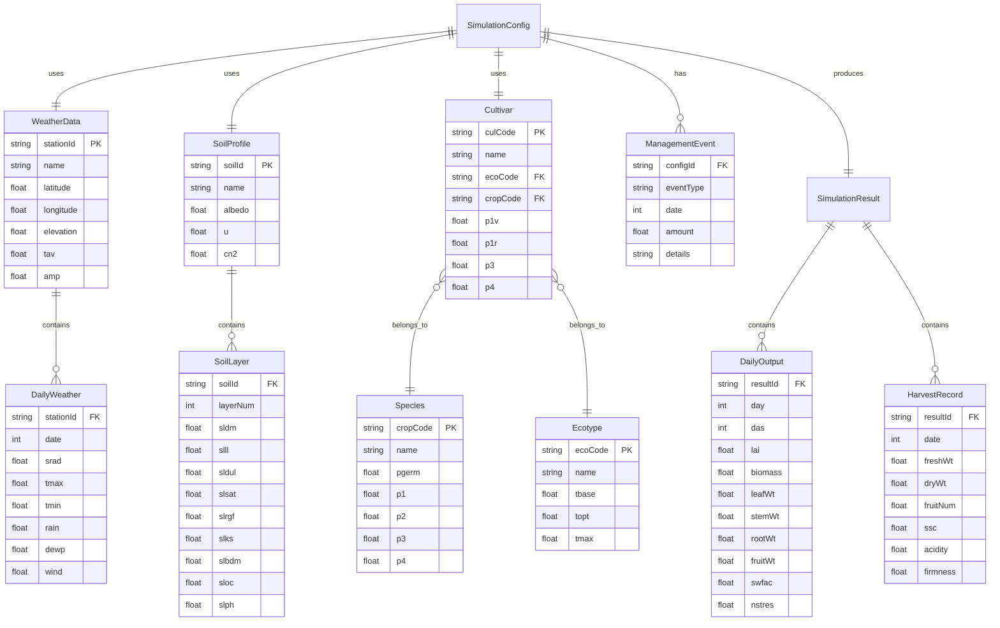

# 草莓作物模拟系统 - 技术架构文档

## 1. 架构设计

纯前端架构，所有计算逻辑在浏览器端运行，无需后端服务。

```mermaid
flowchart TB
    subgraph "浏览器端"
        subgraph "UI 层"
            "Vue3 组件"
            "Vue Router"
            "Pinia 状态管理"
        end
        subgraph "业务逻辑层"
            "模拟引擎 Runner"
            "DSSAT 文件解析器"
            "品质预测模块"
        end
        subgraph "核心计算层"
            "物候发育模块"
            "光合生产模块"
            "土壤水分模块"
            "土壤氮素模块"
            "草莓专用模块"
        end
        subgraph "数据层"
            "IndexedDB 本地存储"
            "内置品种/气象/土壤数据集"
        end
    end
    subgraph "外部服务（可选）"
        "OpenMeteo 气象 API"
    end

    "UI 层" --> "业务逻辑层"
    "业务逻辑层" --> "核心计算层"
    "业务逻辑层" --> "数据层"
    "UI 层" --> "数据层"
    "业务逻辑层" -.-> "外部服务（可选）"
```

## 2. 技术说明

- **前端框架**：Vue 3 + TypeScript + Vite
- **初始化工具**：vite-init (vue-ts 模板)
- **状态管理**：Pinia
- **路由**：Vue Router 4
- **样式**：Tailwind CSS 3
- **图表库**：ECharts 5（通过 vue-echarts 集成）
- **本地存储**：Dexie.js（IndexedDB 封装）
- **后端**：无（纯前端）
- **数据库**：IndexedDB（浏览器本地存储）
- **部署**：GitHub Pages / Vercel（静态站点）

## 3. 路由定义

| 路由 | 用途 |
|------|------|
| `/` | 首页/模拟配置页 |
| `/simulation` | 模拟运行页 |
| `/results` | 结果分析页 |
| `/cultivars` | 品种参数库页 |
| `/data` | 数据管理页 |

## 4. 数据模型

### 4.1 数据模型定义



## 5. 核心模拟引擎设计

### 5.1 日步长迭代主循环

```
for each day:
  1. 读取当日气象数据 (srad, tmax, tmin, rain, etc.)
  2. 计算土壤水分平衡 (蒸发、蒸腾、径流、渗漏)
  3. 计算土壤氮素平衡 (矿化、硝化、吸收)
  4. 计算物候发育速率 (积温、生育期推进)
  5. 计算冠层光合与呼吸
  6. 计算干物质分配 (叶/茎/根/果实)
  7. 草莓专用: 连续开花结果、多次采收
  8. 计算水分/氮素胁迫因子
  9. 更新植物和土壤状态
  10. 检查采收事件，记录产量和品质
  11. 输出当日结果
```

### 5.2 模块依赖关系

```mermaid
flowchart LR
    "气象输入" --> "土壤水分"
    "气象输入" --> "物候发育"
    "气象输入" --> "光合生产"
    "土壤水分" --> "水分胁迫"
    "土壤氮素" --> "氮素胁迫"
    "物候发育" --> "光合生产"
    "物候发育" --> "干物质分配"
    "光合生产" --> "干物质分配"
    "水分胁迫" --> "光合生产"
    "氮素胁迫" --> "光合生产"
    "干物质分配" --> "草莓专用模块"
    "草莓专用模块" --> "品质预测"
    "草莓专用模块" --> "采收记录"
```

## 6. 项目目录结构

```
strawberry-sim/
├── src/
│   ├── engine/                  # 核心模拟引擎
│   │   ├── types.ts             # 引擎类型定义
│   │   ├── runner.ts            # 日步长迭代主循环
│   │   ├── phenology.ts         # 物候发育模块
│   │   ├── photosynthesis.ts    # 光合生产模块
│   │   ├── soil-water.ts        # 土壤水分平衡
│   │   ├── soil-nitrogen.ts     # 土壤氮素平衡
│   │   ├── strawberry.ts        # 草莓专用模块
│   │   ├── quality.ts           # 品质预测模块
│   │   └── stress.ts            # 胁迫因子计算
│   ├── parser/                  # DSSAT 文件解析器
│   │   ├── types.ts             # 解析器类型定义
│   │   ├── weather.ts           # .WTH 气象文件解析
│   │   ├── soil.ts              # .SOL 土壤文件解析
│   │   ├── cultivar.ts          # .CUL 品种文件解析
│   │   ├── species.ts           # .SPE 物种文件解析
│   │   ├── ecotype.ts           # .ECO 生态型文件解析
│   │   └── index.ts             # 统一导出
│   ├── data/                    # 内置数据集
│   │   ├── cultivars/           # 品种参数数据
│   │   ├── weather/             # 示例气象数据
│   │   ├── soil/                # 示例土壤数据
│   │   └── species/             # 物种参数数据
│   ├── stores/                  # Pinia 状态管理
│   │   ├── simulation.ts        # 模拟状态
│   │   ├── config.ts            # 配置状态
│   │   └── cultivar.ts          # 品种库状态
│   ├── composables/             # Vue 组合式函数
│   │   ├── useSimulation.ts     # 模拟运行控制
│   │   ├── useChart.ts          # 图表配置
│   │   └── useFileParser.ts     # 文件解析
│   ├── components/              # UI 组件
│   │   ├── layout/              # 布局组件
│   │   ├── config/              # 配置表单组件
│   │   ├── simulation/          # 模拟运行组件
│   │   ├── charts/              # 图表组件
│   │   └── common/              # 通用组件
│   ├── pages/                   # 页面组件
│   │   ├── ConfigPage.vue       # 模拟配置页
│   │   ├── SimulationPage.vue   # 模拟运行页
│   │   ├── ResultsPage.vue      # 结果分析页
│   │   ├── CultivarsPage.vue    # 品种参数库页
│   │   └── DataPage.vue         # 数据管理页
│   ├── router/                  # 路由配置
│   │   └── index.ts
│   ├── utils/                   # 工具函数
│   │   ├── date.ts              # 日期处理
│   │   ├── format.ts            # 数据格式化
│   │   └── export.ts            # 数据导出
│   ├── App.vue
│   ├── main.ts
│   └── style.css
├── public/
├── tests/                       # 测试
│   ├── engine/                  # 引擎单元测试
│   └── parser/                  # 解析器单元测试
├── package.json
├── tsconfig.json
├── vite.config.ts
├── tailwind.config.js
└── postcss.config.js
```
